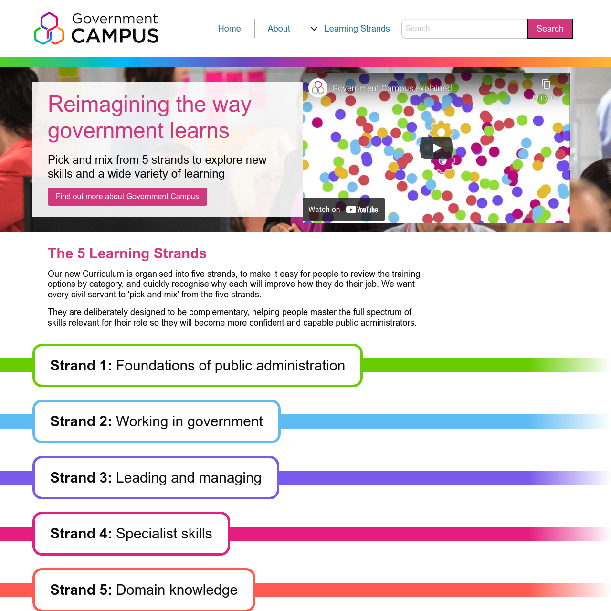

# Getting Started with Campus Online

This project was bootstrapped with [Create React App](https://github.com/facebook/create-react-app). Current technologies used in the project are `ReactJS`, `FoundationCSS` & `React-Testing-Library`.

## Setup

- Run `yarn` to install the dependencies
- Run `yarn start` which runs the app in the development mode. Open [http://localhost:3000](http://localhost:3000) to view it in your browser.
- Run `yarn test` launches the test runner in the interactive watch mode

## Web App Architecture

- `assets/` contains images and icons
- `components/` contains re-usable components
- `context/` contains global state management
- `copytable/` copy across the app in managed in a json file
- `hooks/` re-usable state logic that can be used across components
- `services/` contains api services
- `styles/` contains global style settings
- `util/` contains small useful code helpers
- `views/` different page views defined here
